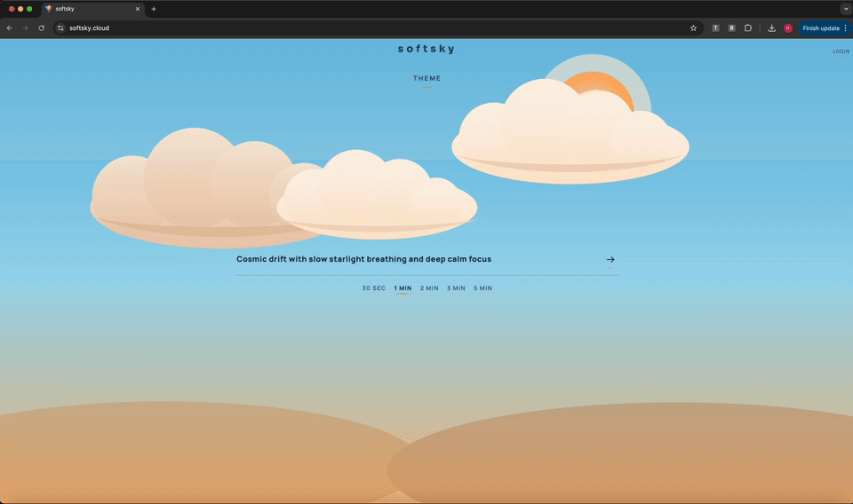
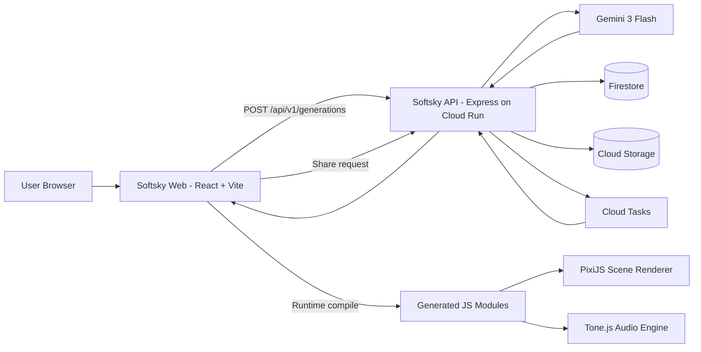

# Softsky

Softsky is an intent-driven calm-space generator that composes real-time visuals and ambient music from a single prompt.

Live app: [https://www.softsky.cloud](https://www.softsky.cloud)

<p align="center">
  
</p>

## What Softsky Does

1. Takes a short user intention.
2. Generates visual scene code (PixiJS) and music code (Tone.js) with Gemini.
3. Renders both directly in-browser.
4. Lets users save, replay, and share generated sessions with a URL.

Unlike pre-rendered media workflows, Softsky generates executable creative logic (code), then runs it live for fast and highly personalized output.

## Product Highlights

1. Prompt-to-experience flow with dynamic code generation.
2. Real-time canvas visuals with modular scene runtime.
3. Real-time synthesized music with session-safe teardown.
4. Google sign-in, per-user generation history, and share links.
5. Anonymous free-tier limit with gated sharing for signed-in users.
6. Mobile and desktop responsive playback controls.

## Architecture



## Request Flow

1. Frontend posts intention, duration, theme, and time-of-day to `POST /api/v1/generations`.
2. Backend builds strict prompts from:
   - `backend/prompts/scene_master_prompt.txt`
   - `backend/prompts/music_master_prompt.txt`
3. Backend calls Gemini (`@google/genai`), validates generated code, retries correction on invalid output.
4. Backend stores generation metadata/code in Firestore + Cloud Storage via the generation store.
5. Frontend compiles generated scene/music modules at runtime and starts rendering/playback.
6. Signed-in users can create shares directly or via async jobs (`/api/v1/jobs`) backed by Cloud Tasks.

## Security and Limits

1. Google OAuth is handled server-side.
2. Sessions use signed HttpOnly cookies.
3. Anonymous users are limited by signed visitor identity cookie (`GENERATION_ANON_LIMIT`, default `3`).
4. Sharing and generation history require authenticated users.
5. CORS is allowlist-driven through `SHARE_ALLOWED_ORIGINS`.
6. Secrets are environment-based (recommended: Secret Manager in production).

## Tech Stack

### Frontend

1. React 19 + Vite
2. PixiJS for visual scene rendering
3. Tone.js for procedural audio synthesis

### Backend

1. Node.js + Express
2. Google Gemini via `@google/genai`
3. Firestore for metadata and indexing
4. Cloud Storage for payload persistence
5. Cloud Tasks for async share processing

### Infra

1. Cloud Run (`softsky-web`, `softsky-api`)
2. Domain: `www.softsky.cloud`

## Endpoints (API)

1. `GET /api/v1/healthz`
2. `GET /api/v1/auth/config`
3. `GET /api/v1/auth/session`
4. `GET /api/v1/auth/google/start`
5. `GET /api/v1/auth/google/callback`
6. `POST /api/v1/auth/complete`
7. `POST /api/v1/auth/logout`
8. `POST /api/v1/generations`
9. `GET /api/v1/generations`
10. `GET /api/v1/generations/:generationId`
11. `POST /api/v1/generations/:generationId/thumbnail`
12. `POST /api/v1/shares`
13. `GET /api/v1/shares/:shareId`
14. `GET /api/v1/shares/:shareId/stats`
15. `POST /api/v1/jobs`
16. `GET /api/v1/jobs/:jobId`
17. `POST /api/v1/internal/jobs/process`

## Local Development

```bash
npm install
npm --prefix backend install

# terminal 1
npm run dev:api

# terminal 2
npm run dev
```

Frontend default: `http://localhost:5173`  
API default: `http://localhost:8080`

## Environment Variables (Backend)

### Required

1. `GEMINI_API_KEY`
2. `GOOGLE_OAUTH_CLIENT_ID`
3. `GOOGLE_OAUTH_CLIENT_SECRET`
4. `GOOGLE_OAUTH_REDIRECT_URI`
5. `AUTH_SESSION_SECRET`

### Common Production

1. `SHARE_STORE_DRIVER` (`gcp` recommended)
2. `SHARE_ALLOWED_ORIGINS`
3. `SHARE_PUBLIC_BASE_URL`
4. `GOOGLE_CLOUD_PROJECT`
5. `SHARE_GCS_BUCKET`
6. `GENERATION_FIRESTORE_COLLECTION`
7. `SHARE_TASKS_PROJECT_ID`
8. `SHARE_TASKS_LOCATION`
9. `SHARE_TASKS_QUEUE`
10. `SHARE_TASKS_WORKER_URL`

## Credits

1. [PixiJS](https://pixijs.com/) for fast real-time visual rendering.
2. [Tone.js](https://tonejs.github.io/) for procedural audio synthesis and transport scheduling.
3. [Google Gemini](https://ai.google.dev/) for scene and music code generation.
4. [React](https://react.dev/) and [Vite](https://vitejs.dev/) for the frontend foundation.
5. [Google Cloud Run, Firestore, Cloud Storage, Cloud Tasks](https://cloud.google.com/) for scalable backend infrastructure.
